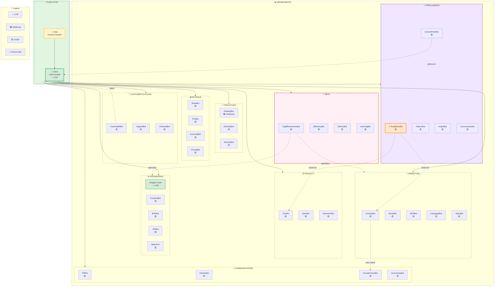
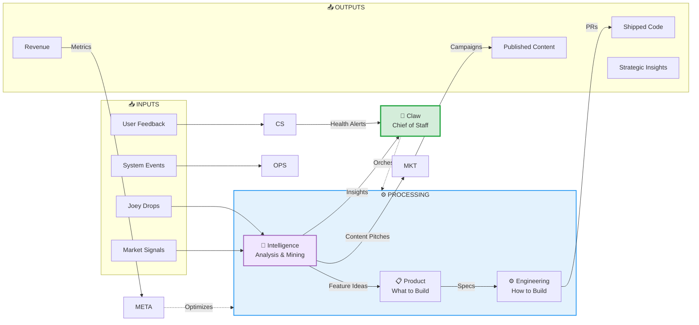

# AGENT-COMPANY-v3.md — The Full DropAnywhere Organization

**The Complete Agent-Native Company**  
**Based on:** 18 months of operational patterns + real company functions  
**Date:** 2026-03-15  
**Status:** Architecture v3.0 — Comprehensive  

---

## Executive Summary

A real company needs more than engineers. This defines a **complete organization** with 10 departments and 40 specialized agents.

**New Departments:**
- **Marketing** — Content, campaigns, social, SEO
- **Communications** — PR, press, partnerships, founder voice  
- **Intelligence** — Drop analysis, content mining, pattern recognition
- **Meta** — Organizational effectiveness, agent performance, system optimization

---

## The 10 Departments

| Dept | Focus | Key Agents |
|------|-------|------------|
| **Executive** | Strategy, orchestration | Claw |
| **Product** | What to build | DocBot, SpecBot, ResearchBot |
| **Engineering** | How to build | Dropper-Code, FrontEndBot, BHABot |
| **Operations** | Infrastructure | RailwayBot, DevOpsBot |
| **Revenue** | Money flow | StripeBot, PoeBot, GumroadBot |
| **Customer Success** | User health | UserHealthBot, SupportBot |
| **Marketing** | Voice, brand | ContentBot, SocialBot, SEOBot |
| **Communications** | Relations, PR | PRBot, FounderVoiceBot |
| **Intelligence** | Analysis, mining | DropMinerBot, ContentPitchBot |
| **Meta** | System optimization | OrgEffectivenessBot, LearningBot |

---

## Organization Chart (Visual)



---

## Communication Flow Diagram



---

## NEW: Intelligence Department

### DropMinerBot ⭐
**Mission:** Continuously analyze Joey's drops

**Extracts:**
- Feature requests → Product queue
- Content gold → Marketing queue
- Strategic insights → Joey/Claw
- Emotional patterns → Private flags

### ContentPitchBot
**Mission:** Transform drops into content ideas

**Example:**
- **Drop:** "Over-engineering the digest pipeline"
- **Pitch:** "The Day I Deleted 400 Lines" 
- **Format:** LinkedIn thread on vulnerability

---

## NEW: Marketing Department

| Agent | Role |
|-------|------|
| ContentBot | Blog posts, threads |
| SocialBot | LinkedIn, Twitter/X |
| SEOBot | Keywords, rankings |
| VideoBot | Reels, shorts |

---

## NEW: Communications Department

| Agent | Role |
|-------|------|
| PRBot | Press outreach |
| FounderVoiceBot | Ghostwrites as Joey |
| PartnerBot | Integrations |

**FounderVoiceBot:** All public content routes through for tone check.

---

## NEW: Meta Department

| Agent | Role |
|-------|------|
| OrgEffectivenessBot | Analyze agent performance |
| LearningBot | Capture lessons learned |
| MetricsBot | KPI tracking |

---

## Full Roster: 40 Agents

| # | Agent | Dept | Status |
|---|-------|------|--------|
| 1 | Claw | Executive | ✅ LIVE |
| 2 | Dropper-Code | Engineering | ✅ LIVE |
| 3 | RailwayBot | Operations | 🟢 Initializing |
| 4-22 | [Original agents] | Various | 🟡 Create |
| 23 | **ContentBot** | Marketing | 🟡 Create |
| 24 | **SocialBot** | Marketing | 🟡 Create |
| 25 | **SEOBot** | Marketing | 🟡 Create |
| 26 | **CampaignBot** | Marketing | 🟡 Create |
| 27 | **VideoBot** | Marketing | 🟡 Create |
| 28 | **PRBot** | Communications | 🟡 Create |
| 29 | **PartnerBot** | Communications | 🟡 Create |
| 30 | **FounderVoiceBot** | Communications | 🟡 Create |
| 31 | **CommunityBot** | Communications | 🟡 Create |
| 32 | **DropMinerBot** ⭐ | Intelligence | 🟡 Create |
| 33 | **PatternBot** | Intelligence | 🟡 Create |
| 34 | **ContentPitchBot** | Intelligence | 🟡 Create |
| 35 | **InsightBot** | Intelligence | 🟡 Create |
| 36 | **ConversationBot** | Intelligence | 🟡 Create |
| 37 | **OrgEffectivenessBot** | Meta | 🟡 Create |
| 38 | **EfficiencyBot** | Meta | 🟡 Create |
| 39 | **MetricsBot** | Meta | 🟡 Create |
| 40 | **LearningBot** | Meta | 🟡 Create |

---

## Key Workflow: Drop to Published Content

```
Joey drops insight
    ↓
DropMinerBot → flags content-worthy
    ↓
ContentPitchBot generates 3 angles
    ↓
Pitches to Claw/Joey
    ↓
Joey approves
    ↓
ContentBot creates
    ↓
FounderVoiceBot tone-checks
    ↓
SocialBot posts + SEOBot optimizes
```

---

*This is a complete company. Not just engineering — marketing, PR, intelligence, meta-analysis.*

